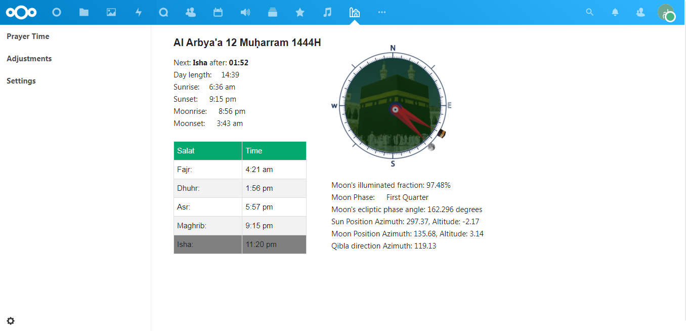

# Salat Time
 * 5 muslim daily prayer times
 * Hijri date
 * Qibla direction 
 * Adhan notification
 * DAV Calendar Integration
 * Widget on Dashboard
 * and many others useful informations.




## Building the app

The app can be built by using the provided Makefile by running:

    make

This requires the following things to be present:
* make
* which
* tar: for building the archive
* npm: for building and testing everything JS, only required if a package.json is placed inside the **src/** folder

The make command will install or update Composer dependencies if a composer.json is present and also **npm run build** if a package.json is present in the **src/** folder. The npm **build** script should use local paths for build systems and package managers, so people that simply want to build the app won't need to install npm libraries globally, e.g.:

**package.json**:
```json
"scripts": {
    "test": "node node_modules/gulp-cli/bin/gulp.js karma",
    "prebuild": "npm install && node_modules/bower/bin/bower install && node_modules/bower/bin/bower update",
    "build": "node node_modules/gulp-cli/bin/gulp.js"
}
```
